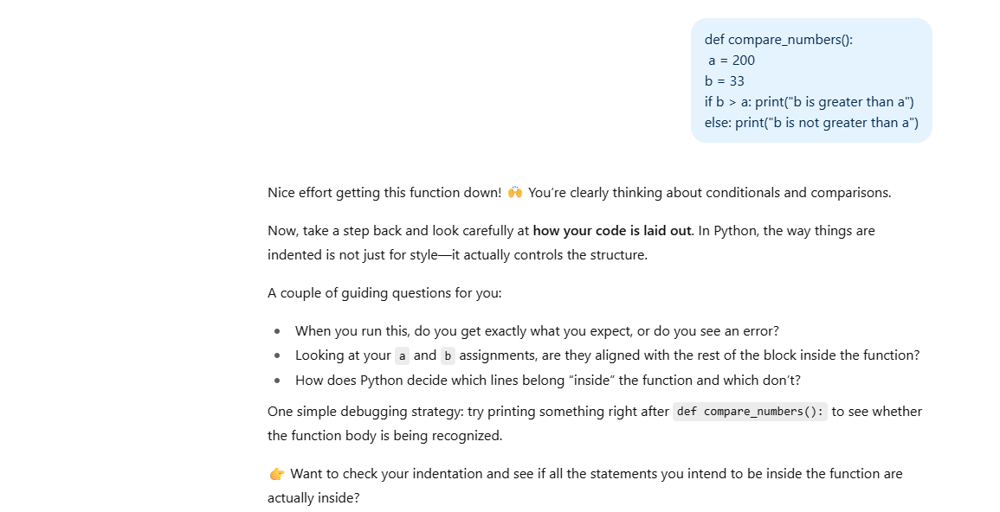

# FOSSEE Python Screening Task 2 – AI Debugging Assistant 

The designed prompt is available in (PROMPT.md). 
---

## Reasoning Behind the Design 

### 1. Tone and Style
I chose a **supportive, tutoring-like tone**. Research in education & science shows that learners engage better when feedback is encouraging rather than judgmental. The assistant is asked to act as a "guide on the side" not a "sage on the stage" or a strict traditional tutor. This ensures that students feel motivated to explore solutions independently. 

### 2. Balancing Bugs vs Guidance
The AI should identify **possible problem areas** but stop short of giving away the fix. Instead of directly spoon-feeding solutions, it asks **guiding questions** (as “What value do you expect this variable to hold at this point?”). This shows how good human tutors approach teaching & fostering **critical thinking and debugging habits** in a student.  

### 3. Adaptation for Different Learners
The prompt includes **dual-layer adaptability**:
- **For Beginners** - receive simple, step-by-step explanations, analogies, and encouragement.  
- **For Advanced learners** - get deeper hints around efficiency, structure, and best practices.  
This flexibility ensures the same prompt can work across diverse learners. 

--- 

## Research Foundation 
This design is grounded in established **prompt engineering frameworks from 2022 to 2025:**
- **Clarity & specificity** - Strong prompts clearly define role, task, and constraints (OpenAI, 2023)
- **Role prompting** - Assigning the AI the persona of a “Debugging Assistant” improves alignment and consistency (Anthropic, 2024).   
- **Step-by-step reasoning** - Inspired by *Chain-of-Thought prompting* the assistant guides learners through logic rather than answers.
- **Scaffolded hints** - Borrowed from educational scaffolding theories, the assistant provides **progressive hints** instead of full solutions. 
- **Framework Inspiration** - Elements of the **o1 Anatomy (Brockman, 2025)** and **Microsoft GCES (2024)** frameworks shaped the structured format (role → task → constraints → guidance). 
 
<mark>*For a detailed discussion of these frameworks, see (./ResearchBackup_FOSSEE.pdf), which I authored as supporting research for this task & every submission & prompt is based on that research snippet authored by me, by taking references from various sources on the web.*</mark>

Few of the major resources are:-
- Jason Wei (2022) — Chain‑of‑Thought Prompting Elicits Reasoning in Large Language Models.
- Xuezhi Wang (2022/ICLR 2023) — Self‑Consistency Improves Chain‑of‑Thought Reasoning in LMs (aggregate multiple CoT paths).
- Denny Zhou (2022/ICLR 2023) — Least‑to‑Most Prompting Enables Complex Reasoning in LLMs (solve via ordered subproblems).
- Huaixiu Steven Zheng (2023/ICLR 2024) — Take a Step Back: Evoking Reasoning via Abstraction in LLMs (Step‑Back prompting).
- Shunyu Yao (2022) — ReAct: Synergizing Reasoning and Acting (interleave thoughts with tool actions).
- Shunyu Yao (NeurIPS 2023) — Tree of Thoughts: Deliberate Problem Solving with LLMs (search over thought branches).
- Ofir Press (2022) — Measuring and Narrowing the Compositionality Gap (Self‑Ask with Search for multi‑step QA).
- Noah Shinn (2023) — Reflexion: Language Agents with Verbal Reinforcement (self‑critique and memory for iterative improvement).
- Anthropic (2023) — Claude’s Constitution / Constitutional AI (principled self‑critique and aligned prompting).
- OpenAI (2025) — Best practices for prompt engineering (clarity, structure, decomposition, evaluation).
---
## Testing of Our Prompt - ChatGPT (GPT5 Model)

### 01 Prompting the Model - Getting It Ready

### 02 Providing it with the Buggy Code - Guided Debugging Starts

### 03 Knowing the Errors - Guided Debugging Phase

### 04 Making Calculated Guess - Guided Debugging Phase

### 05 Providing it with the Correct Code - Got the Correct Answer

### 06 Further understanding Edge Cases - Additional Questions Around It

---

## Conclusion 
This prompt is **student-centered**: it guides without revealing answers, adapts to skill levels, and builds problem-solving capacity. By blending educational principles with prompt-engineering best practices, it ensures the AI acts as a **true debugging mentor** not as a direct answer tool, cause we want kids to have develop that thinking ability, we don't want them to just mug up the answers or approach method to particular questions.
